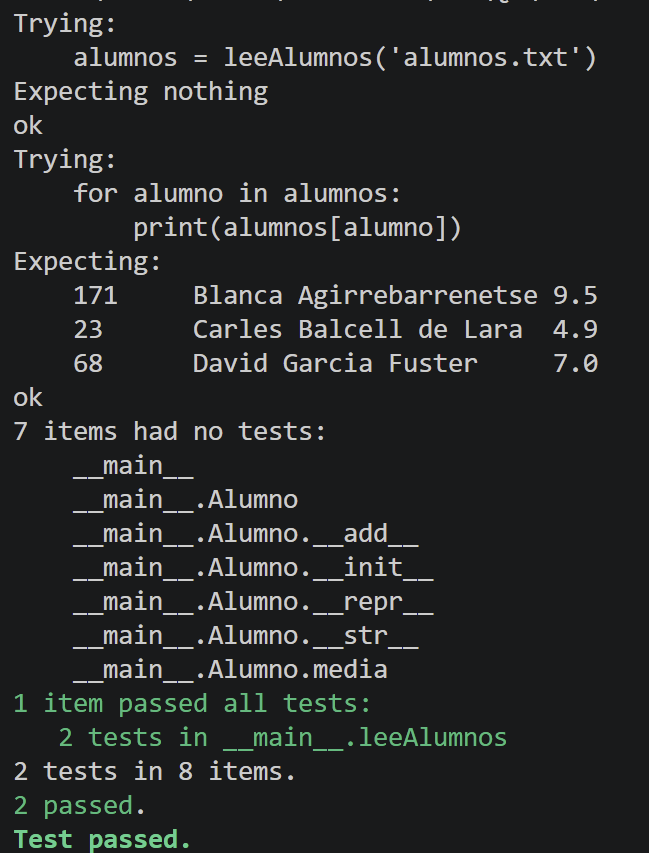

# Expresiones Regulares

## Nom i cognoms

> [!IMPORTANT]
> Introduzca a continuación su nombre y apellidos:
>
> Sandra Cots Agüera

## Aviso Importante

> [!CAUTION]
>
> El objetivo de esta tarea es aprender a usar las expresiones regulares. En concreto, su
> implementación en Python. A los profesores de la asignatura les importa un pimiento si
> usted conoce alguna biblioteca que hace el mismo trabajo de manera más sencilla y/o
> eficiente; su uso está prohibido.
>
> ¿Quiere saber más?, consulte con el profesorado.

## Fecha de entrega: 7 de junio a medianoche

## Tratamiento de ficheros de notas

Con el final de curso llega la ardua tarea de evaluar las tareas realizadas por los alumnos durante el
mismo. Para facilitar esta tarea, se dispone de la clase `Alumno` que proporciona los datos
fundamentales de cada alumno: su número de identificación (`numIden`), su nombre completo
(`nombre`) y la lista de notas obtenidas a lo largo del curso (`notas`). La clase también
proporciona métodos para añadir una nota al expediente del alumno (`__add__()`), para obtener
la representación *oficial* del mismo (`__repr__()`) y para obtener la representación
*bonita* (`__str__()`).

La definición de la clase `Alumno`, disponible en `alumno.py`, es:

```python
class Alumno:
    """
    Clase usada para el tratamiento de las notas de los alumnos. Cada uno
    incluye los atributos siguientes:

    numIden:   Número de identificación. Es un número entero que, en caso
               de no indicarse, toma el valor por defecto 'numIden=-1'.
    nombre:    Nombre completo del alumno.
    notas:     Lista de números reales con las distintas notas de cada alumno.
    """

    def __init__(self, nombre, numIden=-1, notas=[]):
        self.numIden = numIden
        self.nombre = nombre
        self.notas = [nota for nota in notas]

    def __add__(self, other):
        """
        Devuelve un nuevo objeto 'Alumno' con una lista de notas ampliada con
        el valor pasado como argumento. De este modo, añadir una nota a un
        Alumno se realiza con la orden 'alumno += nota'.
        """
        return Alumno(self.nombre, self.numIden, self.notas + [other])

    def media(self):
        """
        Devuelve la nota media del alumno.
        """
        return sum(self.notas) / len(self.notas) if self.notas else 0

    def __repr__(self):
        """
        Devuelve la representación 'oficial' del alumno. A partir de copia
        y pega de la cadena obtenida es posible crear un nuevo Alumno idéntico.
        """
        return f'Alumno("{self.nombre}", {self.numIden!r}, {self.notas!r})'

    def __str__(self):
        """
        Devuelve la representación 'bonita' del alumno. Visualiza en tres
        columnas separas por tabulador el número de identificación, el nombre
        completo y la nota media del alumno con un decimal.
        """
        return f'{self.numIden}\t{self.nombre}\t{self.media():.1f}'
```

A menudo, las notas de los alumnos se almacenan en ficheros de texto en los que los datos de cada alumno
ocupan una línea con los distintos valores separados por espacios y/o tabuladores.

El ejemplo siguiente muestra un fichero típico con las notas de tres alumnos:

```text
171 Blanca Agirrebarrenetse 10  	9 	  9.5
23  Carles Balcell de Lara  5 	    5 	  4.5  	5.2
68  David Garcia Fuster 	7.75    5.25  8   
```

Añada al fichero `alumno.py` la función `leeAlumnos(ficAlum)` que lea un fichero de texto con los datos de
todos los alumnos y devuelva un diccionario en el que la clave sea el nombre de cada alumno y su contenido
el objeto `Alumno` correspondiente.

La función deberá cumplir los requisitos siguientes:

- Sólo debe realizar lo que se indica; es decir, debe leer el fichero de texto que se le pasa como único
  argumento y devolver un diccionario con los datos de los alumnos.
- El análisis de cada línea de texto se realizará usando expresiones regulares.
- La función `leeAlumnos()` debe incluir, en su cadena de documentación, la prueba unitaria siguiente según
  el formato de la biblioteca `doctest`, donde el fichero `'alumnos.txt'` es el fichero mostrado como ejemplo
  al principio de este enunciado:

  ```python
  >>> alumnos = leeAlumnos('alumnos.txt')
  >>> for alumno in alumnos:
  ...     print(alumnos[alumno])
  ...
  171     Blanca Agirrebarrenetse 9.5
  23      Carles Balcell de Lara  4.9
  68      David Garcia Fuster     7.0
  ```

- Para evitar que diferencias debidas a espacios en blanco o tabuladores den lugar a error, se recomienda
  efectuar las pruebas unitarias con la opción `doctest.NORMALIZE_WHITESPACE`. Por ejemplo,
  `doctest.testmod(optionflags=doctest.NORMALIZE_WHITESPACE)`.

## Análisis de expresiones horarias

En casi todos los idiomas más habituales, cualquier hora puede reducirse al formato estándar HH:MM, donde HH es
un número de dos dígitos, que representa la hora y está comprendido entre 00 y 23, y MM es otro número de dos
dígitos, que representa el minuto y está comprendido entre 00 y 59.

No obstante, en el lenguaje hablado, es raro usar este formato estándar. En el caso del castellano, existe una
gran variedad de formatos. La lista siguiente alguna de las posibilidades más frecuentes, aunque existen bastantes
más:

- **08:27**

  Es el formato estándar. Cuando la hora es menor que 10, es posible representarla con
  dos dígitos (08:27), o sólo uno (8:27). Los minutos se representan siempre con dos (8:05).

- **8h27m**

  Las horas o minutos menores que 10 pueden representarse usando uno o dos dígitos. Las horas
  *en punto* pueden indicarse sin minutos (8h).

- **8 en punto**

  Las horas exactas suelen indicarse con la partícula *'en punto'*. En ese caso, es
  habitual omitir la letra *h* después de la cifra.

  Otras alternativas semejantes son las *'8 y cuarto'*, las *'8 y media'* o las *'8 menos cuarto'*.

  En todos estos casos, el reloj empleado será de 12 horas y empezando en 1 (de 1 a 12). El
  resultado será ambiguo, ya que no sabremos si una cierta hora es AM o PM, pero así es cómo
  se suele hablar. El resultado se devolverá siempre en el rango de 00:00 a 11:59.

- **... de la mañana**

  Las expresiones horarias entre las 4 y las 12 pueden ir seguidas de la partícula *'de la mañana'*.

  Análogamente, las horas entre las 12 y las 3 pueden ir seguidas de *'del mediodía'*, las horas entre
  las 3 y las 8 pueden serlo de *'de la tarde'*, entre 8 y 4 de *'de la noche'* y entre 1 y
  6 de *'de la madrugada'*.

  En estos casos, el reloj empleado es siempre de 12 horas. Además la hora no puede ser cero, sino
  que, en ese caso, se usaría 12.

### Tarea: normalización de las expresiones horarias de un texto

Escriba el fichero `horas.py` con la función `normalizaHoras(ficText, ficNorm)`, que lee el fichero de
texto `ficText`, lo analiza en busca de expresiones horarias y escribe el fichero `ficNorm` en el que
éstas se expresan según el formato normalizado, con las horas y los minutos indicados por dos dígitos
y separados por dos puntos (08:27).

Las horas con expresión incorrecta deben dejarse tal cual.

## Ejecución de los tests unitarios de `alumno.py`



## Código desarrollado

### `alumno.py`

```python
"""
Alumno - Tratamiento de notas de alumnos con expresiones regulares.
Autor: Fulano Mengano Zutano
"""

import re
import doctest


def leeAlumnos(ficAlum):
    """
    Lee un fichero de texto con datos de alumnos y devuelve un diccionario
    cuya clave es el nombre del alumno y el valor es el objeto Alumno.

    Cada línea del fichero tiene el formato:
        numIden  Nombre Completo  nota1  nota2  ...

    >>> alumnos = leeAlumnos('alumnos.txt')
    >>> for alumno in alumnos:
    ...     print(alumnos[alumno])
    ...
    171     Blanca Agirrebarrenetse 9.5
    23      Carles Balcell de Lara  4.9
    68      David Garcia Fuster     7.0
    """
    alumnos = {}
    patron = re.compile(
        r'^\s*(\d+)\s+'           # numIden
        r'([A-Za-záéíóúÁÉÍÓÚüÜñÑ]+'  # primera palabra del nombre
        r'(?:\s+[A-Za-záéíóúÁÉÍÓÚüÜñÑ]+)*)\s+'  # resto de palabras del nombre
        r'([\d.]+(?:\s+[\d.]+)*)\s*$'  # notas
    )
    with open(ficAlum, encoding='utf-8') as f:
        for linea in f:
            m = patron.match(linea)
            if not m:
                continue
            numIden = int(m.group(1))
            nombre = m.group(2)
            notas = [float(n) for n in re.findall(r'[\d.]+', m.group(3))]
            alumnos[nombre] = Alumno(nombre, numIden, notas)
    return alumnos


class Alumno:
    """
    Clase usada para el tratamiento de las notas de los alumnos. Cada uno
    incluye los atributos siguientes:

    numIden:   Número de identificación. Es un número entero que, en caso
               de no indicarse, toma el valor por defecto 'numIden=-1'.
    nombre:    Nombre completo del alumno.
    notas:     Lista de números reales con las distintas notas de cada alumno.
    """

    def __init__(self, nombre, numIden=-1, notas=[]):
        self.numIden = numIden
        self.nombre = nombre
        self.notas = [nota for nota in notas]

    def __add__(self, other):
        """
        Devuelve un nuevo objeto 'Alumno' con una lista de notas ampliada con
        el valor pasado como argumento. De este modo, añadir una nota a un
        Alumno se realiza con la orden 'alumno += nota'.
        """
        return Alumno(self.nombre, self.numIden, self.notas + [other])

    def media(self):
        """
        Devuelve la nota media del alumno.
        """
        return sum(self.notas) / len(self.notas) if self.notas else 0

    def __repr__(self):
        """
        Devuelve la representación 'oficial' del alumno. A partir de copia
        y pega de la cadena obtenida es posible crear un nuevo Alumno idéntico.
        """
        return f'Alumno("{self.nombre}", {self.numIden!r}, {self.notas!r})'

    def __str__(self):
        """
        Devuelve la representación 'bonita' del alumno. Visualiza en tres
        columnas separas por tabulador el número de identificación, el nombre
        completo y la nota media del alumno con un decimal.
        """
        return f'{self.numIden}\t{self.nombre}\t{self.media():.1f}'


if __name__ == '__main__':
    doctest.testmod(optionflags=doctest.NORMALIZE_WHITESPACE, verbose=True)
```

### `horas.py`

```python
"""
horas.py - Normalización de expresiones horarias en castellano.
Autor: Fulano Mengano Zutano
"""

import re

_PER = r'la mañana|la tarde|la noche|la madrugada|el mediodía|mediodía'

_PATRON = re.compile(
    r'\d{1,2}h(?:\d{1,2}m)?(?:\s+de\s+(?:' + _PER + r'))?'
    r'|\d{1,2}:\d{2}'
    r'|\d{1,2}\s+(?:en punto|y cuarto|y media|menos cuarto)\s+de\s+(?:' + _PER + r')'
    r'|\d{1,2}\s+de\s+(?:' + _PER + r')'
    r'|\d{1,2}\s+(?:en punto|y cuarto|y media|menos cuarto)'
)


def _periodo_a_h24(h, periodo):
    """Convierte hora 1-12 + periodo a hora 0-23, o None si inválido."""
    rangos = {
        'la mañana':    (4, 12),
        'el mediodía':  (12, 3),
        'mediodía':     (12, 3),
        'la tarde':     (3, 8),
        'la noche':     (8, 12),
        'la madrugada': (1, 6),
    }
    ini, fin = rangos[periodo]

    def en_rango(x, i, f):
        return (i <= x <= f) if i <= f else (x >= i or x <= f)

    if not en_rango(h, ini, fin):
        return None

    if periodo == 'la mañana':
        return 0 if h == 12 else h
    if periodo in ('el mediodía', 'mediodía'):
        return 12 if h == 12 else h + 12
    if periodo == 'la tarde':
        return h + 12
    if periodo == 'la noche':
        return 0 if h == 12 else h + 12
    if periodo == 'la madrugada':
        return 0 if h == 12 else h
    return None


def _mod_a_mn(mod):
    return {'en punto': 0, 'y cuarto': 15, 'y media': 30, 'menos cuarto': -15}[mod]


def _normaliza(match):
    texto = match.group(0)

    # HH:MM
    m = re.fullmatch(r'(\d{1,2}):(\d{2})', texto)
    if m:
        h, mn = int(m.group(1)), int(m.group(2))
        if 0 <= h <= 23 and 0 <= mn <= 59:
            return f'{h:02d}:{mn:02d}'
        return texto

    # Hh[MMm] [de periodo]
    m = re.fullmatch(r'(\d{1,2})h(?:(\d{1,2})m)?(?:\s+de\s+(' + _PER + r'))?', texto)
    if m:
        h = int(m.group(1))
        mn = int(m.group(2)) if m.group(2) else 0
        periodo = m.group(3)
        if periodo:
            if not (1 <= h <= 12 and 0 <= mn <= 59):
                return texto
            h24 = _periodo_a_h24(h, periodo)
            return f'{h24:02d}:{mn:02d}' if h24 is not None else texto
        if 0 <= h <= 23 and 0 <= mn <= 59:
            return f'{h:02d}:{mn:02d}'
        return texto

    # H mod de periodo
    m = re.fullmatch(
        r'(\d{1,2})\s+(en punto|y cuarto|y media|menos cuarto)\s+de\s+(' + _PER + r')',
        texto)
    if m:
        h, mod, periodo = int(m.group(1)), m.group(2), m.group(3)
        if not (1 <= h <= 12):
            return texto
        mn = _mod_a_mn(mod)
        if mn < 0:
            h, mn = (h - 1) or 12, mn + 60
        h24 = _periodo_a_h24(h, periodo)
        return f'{h24:02d}:{mn:02d}' if h24 is not None else texto

    # H de periodo
    m = re.fullmatch(r'(\d{1,2})\s+de\s+(' + _PER + r')', texto)
    if m:
        h, periodo = int(m.group(1)), m.group(2)
        if not (1 <= h <= 12):
            return texto
        h24 = _periodo_a_h24(h, periodo)
        return f'{h24:02d}:00' if h24 is not None else texto

    # H mod (reloj 12h, ambiguo)
    m = re.fullmatch(r'(\d{1,2})\s+(en punto|y cuarto|y media|menos cuarto)', texto)
    if m:
        h, mod = int(m.group(1)), m.group(2)
        if not (1 <= h <= 12):
            return texto
        mn = _mod_a_mn(mod)
        if mn < 0:
            h, mn = (h - 1) or 12, mn + 60
        return f'{h % 12:02d}:{mn:02d}'

    return texto


def normalizaHoras(ficText, ficNorm):
    """
    Lee ficText, sustituye las expresiones horarias válidas por su forma
    normalizada HH:MM y escribe el resultado en ficNorm.
    """
    with open(ficText, encoding='utf-8') as fin, \
         open(ficNorm, 'w', encoding='utf-8') as fout:
        for linea in fin:
            fout.write(_PATRON.sub(_normaliza, linea))


if __name__ == '__main__':
    normalizaHoras('horas.txt', 'horas_norm.txt')
    with open('horas_norm.txt', encoding='utf-8') as f:
        print(f.read())
```
