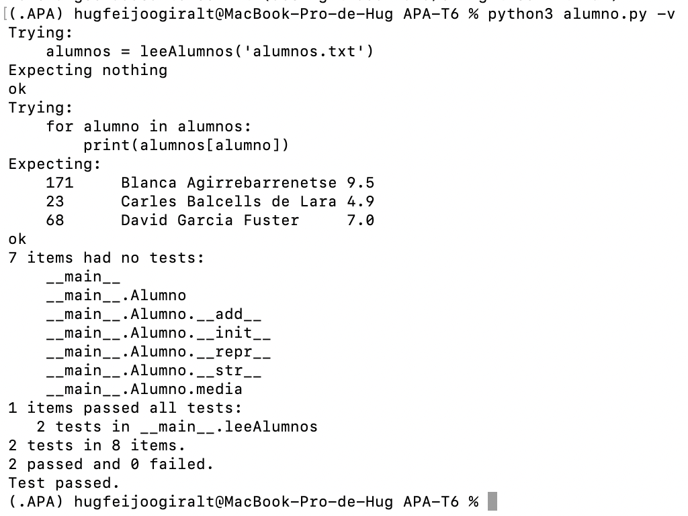

# Expresiones Regulares

## Nom i cognoms

> [!Important]
> Introduzca a continuación su nombre y apellidos:
>
> Hug Feijoo Giralt

## Aviso Importante

> [!Caution]
> 
> El objetivo de esta tarea es aprender a usar las expresiones regulares. En concreto, su
> implementación en Python. A los profesores de la asignatura les importa un pimiento si
> usted conoce alguna biblioteca que hace el mismo trabajo de manera más sencilla y/o
> eficiente; su uso está prohibido.
>
> ¿Quiere saber más?, consulte con el profesorado.
 
## Fecha de entrega: 7 de junio a medianoche

## Tratamiento de ficheros de notas

Con el final de curso llega la ardua tarea de evaluar las tareas realizadas por los alumnos durante el
mismo. Para facilitar esta tarea, se dispone de la clase `Alumno` que proporciona los datos
fundamentales de cada alumno: su número de identificación (`numIden`), su nombre completo 
(`nombre`) y la lista de notas obtenidas a lo largo del curso (`notas`). La clase también
proporciona métodos para añadir una nota al expediente del alumno (`__add__()`), para obtener
la representación *oficial* del mismo (`__repr__()`) y para obtener la representación
*bonita* (`__str__()`).

Se ha añadido al fichero `alumno.py` la función `leeAlumnos(ficAlum)`, que lee un fichero de texto
con los datos de todos los alumnos y devuelve un diccionario cuya clave es el nombre de cada alumno
y cuyo contenido es el objeto `Alumno` correspondiente. El análisis de cada línea del fichero se
realiza mediante expresiones regulares.

## Análisis de expresiones horarias

Se ha escrito el fichero `horas.py` con la función `normalizaHoras(ficText, ficNorm)`, que lee el
fichero de texto `ficText`, lo analiza en busca de expresiones horarias y escribe el fichero
`ficNorm` en el que éstas se expresan según el formato normalizado HH:MM. Las expresiones horarias
incorrectas se dejan tal cual. Todo el análisis se realiza mediante expresiones regulares.

## Entrega

### Ejecución de los tests unitarios de `alumno.py`

A continuación se muestra el resultado de ejecutar el fichero `alumno.py` con la opción *verbosa*
(`python3 alumno.py -v`), donde se observa la ejecución correcta de los tests unitarios:



### Código desarrollado

#### `alumno.py`

```python
"""
Tarea APA-T6: Expresiones regulares.

Autor: Hug Feijoo Giralt

Este fichero contiene la clase 'Alumno', usada para el tratamiento de las notas
de los alumnos, y la función 'leeAlumnos()', que construye un diccionario de
objetos 'Alumno' a partir de un fichero de texto analizado con expresiones
regulares.
"""

import re


class Alumno:
    """
    Clase usada para el tratamiento de las notas de los alumnos. Cada uno
    incluye los atributos siguientes:

    numIden:   Número de identificación. Es un número entero que, en caso
               de no indicarse, toma el valor por defecto 'numIden=-1'.
    nombre:    Nombre completo del alumno.
    notas:     Lista de números reales con las distintas notas de cada alumno.
    """

    def __init__(self, nombre, numIden=-1, notas=[]):
        self.numIden = numIden
        self.nombre = nombre
        self.notas = [nota for nota in notas]

    def __add__(self, other):
        """
        Devuelve un nuevo objeto 'Alumno' con una lista de notas ampliada con
        el valor pasado como argumento. De este modo, añadir una nota a un
        Alumno se realiza con la orden 'alumno += nota'.
        """
        return Alumno(self.nombre, self.numIden, self.notas + [other])

    def media(self):
        """
        Devuelve la nota media del alumno.
        """
        return sum(self.notas) / len(self.notas) if self.notas else 0

    def __repr__(self):
        """
        Devuelve la representación 'oficial' del alumno. A partir de copia
        y pega de la cadena obtenida es posible crear un nuevo Alumno idéntico.
        """
        return f'Alumno("{self.nombre}", {self.numIden!r}, {self.notas!r})'

    def __str__(self):
        """
        Devuelve la representación 'bonita' del alumno. Visualiza en tres
        columnas separas por tabulador el número de identificación, el nombre
        completo y la nota media del alumno con un decimal.
        """
        return f'{self.numIden}\t{self.nombre}\t{self.media():.1f}'


def leeAlumnos(ficAlum):
    """
    Lee un fichero de texto con los datos de los alumnos y devuelve un
    diccionario en el que la clave es el nombre de cada alumno y el valor el
    objeto 'Alumno' correspondiente.

    Cada línea del fichero contiene el número de identificación, el nombre
    completo y la lista de notas, separados por espacios y/o tabuladores. El
    análisis de cada línea se realiza mediante expresiones regulares.

    >>> alumnos = leeAlumnos('alumnos.txt')
    >>> for alumno in alumnos:
    ...     print(alumnos[alumno])
    ...
    171     Blanca Agirrebarrenetse 9.5
    23      Carles Balcells de Lara 4.9
    68      David Garcia Fuster     7.0
    """
    linea = re.compile(r'(\d+)\s+([^\d]+?)\s+([\d.\s]+)')
    alumnos = {}
    with open(ficAlum, encoding='utf-8') as fpAlum:
        for registro in fpAlum:
            encaje = linea.match(registro)
            if encaje:
                numIden = int(encaje.group(1))
                nombre = encaje.group(2).strip()
                cifras = re.findall(r'\d+\.?\d*', encaje.group(3))
                notas = [float(nota) for nota in cifras]
                alumnos[nombre] = Alumno(nombre, numIden, notas)
    return alumnos


if __name__ == '__main__':
    import doctest
    doctest.testmod(optionflags=doctest.NORMALIZE_WHITESPACE)
```

#### `horas.py`

```python
"""
Tarea APA-T6: Expresiones regulares.

Autor: Hug Feijoo Giralt

Este fichero contiene la función 'normalizaHoras()', que lee un fichero de
texto, busca en él expresiones horarias en los formatos habituales del
castellano y escribe un fichero nuevo en el que dichas expresiones se han
normalizado al formato HH:MM. Las expresiones incorrectas se dejan tal cual.
El análisis se realiza únicamente mediante expresiones regulares.
"""

import re

# Partículas relativas y partes del día.
_RELS = r'en\s+punto|y\s+cuarto|y\s+media|menos\s+cuarto'
_PERS = (
    r'de\s+la\s+mañana|de\s+la\s+tarde|de\s+la\s+noche|'
    r'de\s+la\s+madrugada|del\s+mediodía'
)

# Expresión regular que reconoce todos los formatos horarios contemplados.
_HORA = re.compile(
    r'\b(?:'
    r'(?P<est_h>\d{1,2}):(?P<est_m>\d{1,2})'              # 8:27
    r'|(?P<hm_h>\d{1,2})h(?:(?P<hm_m>\d{1,2})m)?'         # 8h / 8h27m
    r'(?:\s+(?P<hm_per>' + _PERS + r'))?'                # ... de la mañana
    r'|(?P<rel_h>\d{1,2})\s+(?P<rel>' + _RELS + r')'     # 8 en punto
    r'(?:\s+(?P<rel_per>' + _PERS + r'))?'               # ... de la tarde
    r'|(?P<per_h>\d{1,2})\s+(?P<per>' + _PERS + r')'     # 12 de la noche
    r')'
)


def _horaPeriodo(hora, periodo):
    """
    Convierte una hora hablada (reloj de 12) al formato de 24 horas según la
    parte del día indicada. Devuelve 'None' si la hora no es válida para esa
    parte del día.
    """
    periodo = re.sub(r'\s+', ' ', periodo)
    if periodo == 'de la madrugada':
        return hora if 1 <= hora <= 6 else None
    if periodo == 'de la mañana':
        return hora if 4 <= hora <= 12 else None
    if periodo == 'del mediodía':
        if hora == 12:
            return 12
        return hora + 12 if 1 <= hora <= 3 else None
    if periodo == 'de la tarde':
        return hora + 12 if 3 <= hora <= 8 else None
    if periodo == 'de la noche':
        if 8 <= hora <= 11:
            return hora + 12
        if hora == 12:
            return 0
        return hora if 1 <= hora <= 4 else None
    return None


def _normaliza(encaje):
    """
    Recibe un objeto 'match' y devuelve la expresión horaria normalizada al
    formato HH:MM o, si la expresión es incorrecta, el texto original.
    """
    txt = encaje.group(0)
    g = encaje.groupdict()
    periodo = g['hm_per'] or g['rel_per'] or g['per']
    rel = g['rel']

    # Determinación de la hora hablada, los minutos y el tipo de reloj.
    if g['est_h'] is not None:                  # Formato estándar H:MM
        hora, minStr = int(g['est_h']), g['est_m']
        if len(minStr) != 2:                    # los minutos exigen 2 cifras
            return txt
        minuto, doce = int(minStr), False
    elif g['hm_h'] is not None:                 # Formato Hh / HhMm
        hora = int(g['hm_h'])
        minuto = int(g['hm_m']) if g['hm_m'] is not None else 0
        doce = False
    elif g['rel_h'] is not None:                # Formato relativo
        hora, minuto, doce = int(g['rel_h']), 0, True
    else:                                       # Número escueto + periodo
        hora, minuto, doce = int(g['per_h']), 0, True

    # Desplazamiento de horas/minutos según la partícula relativa.
    despHora = 0
    if rel == 'en punto':
        minuto = 0
    elif rel == 'y cuarto':
        minuto = 15
    elif rel == 'y media':
        minuto = 30
    elif rel == 'menos cuarto':
        minuto, despHora = 45, -1

    if not 0 <= minuto <= 59:
        return txt

    if periodo is not None:                     # Reloj de 12 con parte del día
        base = _horaPeriodo(hora, periodo)
        if base is None:
            return txt
        hora = (base + despHora) % 24
    elif doce:                                  # Reloj de 12 sin parte del día
        if not 1 <= hora <= 12:
            return txt
        hora = (hora + despHora) % 12
    elif not 0 <= hora <= 23:                   # Reloj de 24 (estándar / Hh)
        return txt

    return f'{hora:02d}:{minuto:02d}'


def normalizaHoras(ficText, ficNorm):
    """
    Lee el fichero de texto 'ficText', normaliza todas las expresiones
    horarias que encuentra al formato HH:MM y escribe el resultado en el
    fichero 'ficNorm'. Las expresiones horarias incorrectas se mantienen sin
    cambios.
    """
    with open(ficText, encoding='utf-8') as fpText, \
            open(ficNorm, 'w', encoding='utf-8') as fpNorm:
        for linea in fpText:
            fpNorm.write(_HORA.sub(_normaliza, linea))
```
